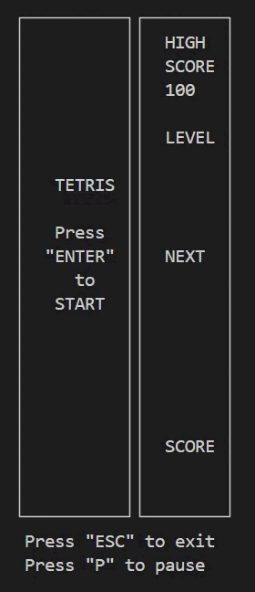

# Tetris

## Содержание

1. [О проекте](#о-проекте)
2. [Особенности проекта](#особенности-проекта)
3. [Сборка](#сборка)

## О проекте

В данном учебном проекте "Школы 21" была реализована классическая игра Тетрис, выполненная в консольной версии на языке C (стандарта C11) и библиотеки Ncurses.h. Игра является первой частью игровых проектов из серии Brick Games и легла в основу второго проекта серии [Змейка](https://github.com/Shyrasya/Snake), в которой также была реализована уже в десктопном виде.

*Консольная игра "Тетрис"*

### Список возможностей программы:

* В игре присутствует 7 типов фигур классического "Тетриса": I, J, L, O, S, Z, T;
* Пользователь может перемещать фигуру с помощью клавиш-стрелок, крутить по часовой стрелке при нажатии на "пробел";
* Присутствует механика ускорения падения фигуры зажатием стрелки "вниз";
* В игре поддерживается режим паузы при нажатии на клавишу **P**;
* В поле дополнительной информации справа показывается следующая фигура, текущий уровень, количество набранных очков, максимальное количество очков, пауза (если включена);
* Текущая падающая фигура при соприкосновении с нижней границей поля или другой фигурой останавливается. Затем происходит генерация следующей фигуры, которая отображается в поле дополнительной информации;
* При заполнении горизонтальной линии из 10 блоков линия уничтожается и происхоит начисление очков: 1 линия - 100 очков, 2 - 300, 3 - 700, 4 - 1500;
* Игра может сохранять максимальное количество очков, набранное за игровую сессию, если было превышение текущего показателя. При повторном запуске игра подгружает сохраненное значение и выводит его в поле дополнительной информации;
* В игре существует возможность проигрыша, когда игрок достигает верхней границы игрового поля. Соответственно всплывает окно "Game Over", где игрок также может выбрать, сыграть ли ему в Тетрис снова или выйти;
* При нажатии на клавишу **Esc** пользователь выходит из игры;
* При наборе 600 очков, уровень игры увеличивается на 1, одновременно повышается и скорость движения фигур. Максимальное возможное количество уровней - 10;

	
	
	 
	Демонстрация работы консольной игры "Тетрис" и десктопная версия игры из <a href="https://github.com/Shyrasya/Snake" target="_blank">проекта "Змейка"</a>

## Особенности проекта

В рамках учебного проекта неоходимо было соответствовать следующим требованиям при написании проекта:

* Программа разработана с использованием компилятора gcc;
* При написании кода необходимо придерживаться Google Style;
* Логика игры основана на конечном автомате (Finite State Machine, FSM);
* Логика игры должна быть написана в соответсвии с приложенной к проекту спецификацией - обязательное наличие структуры GameInfo (для хранения игровой статистики и матрицы, которая описывает текущее состояние игрового поля), UserAction (для хранения всевозможных вариантов нажатий клавиш), функциями userInput (для обработки ввода пользователя) и updateCurrentState (для получения данных для отрисовки в интерфейсе);
* Библиотека с логикой игры покрывается unit-тестами (используется Check, функционируют на ОС Darwin/Ubuntu) более чем 80%;
* Игровое поле имеет размеры 10 пикселей в ширину, 20 - в высоту;
* Создание схемы, отображающей разработанный конечный игровой автомат для Тетриса;

	

	

	*Конечный автомат "Тетриса"*
	

## Сборка

Сборка игры "Тетрис" производится с помощью Makefile. Имеются следующие цели:

&nbsp;&nbsp;&nbsp;&nbsp;``all`` - включает в себя цели clean_all, gcov_report, dist;

&nbsp;&nbsp;&nbsp;&nbsp;``install`` - собирает консольную версию Тетриса и перемещает его в папку build;

&nbsp;&nbsp;&nbsp;&nbsp;``play`` - запускает консольную версию Тетриса;

&nbsp;&nbsp;&nbsp;&nbsp;``uninstall`` - удаляет папку build с проектом;

&nbsp;&nbsp;&nbsp;&nbsp;``clean_all`` - возвращает проект в первоначальный вид;

&nbsp;&nbsp;&nbsp;&nbsp;``install_doxygen`` - устанавливает Doxygen (инструмент для генерации документации из исходного кода);

&nbsp;&nbsp;&nbsp;&nbsp;``dvi`` - генерирует докуменатацию с помощью Doxygen;

&nbsp;&nbsp;&nbsp;&nbsp;``dist`` - создание архив-пакета, содержащего в себе все необходимые файлы и инструкции для установки игры;

&nbsp;&nbsp;&nbsp;&nbsp;``tests`` - запускает unit-тесты на проверку логики игры с помощью библиотеки Check;

&nbsp;&nbsp;&nbsp;&nbsp;``gcov_report`` - генерация html-отчета с помощью lcov для измерения покрытия кода тестами;

&nbsp;&nbsp;&nbsp;&nbsp;``clang`` - анализирует код на стилистические нормы; 

&nbsp;&nbsp;&nbsp;&nbsp;``cpp_check`` - проверка кода на ошибки, уязвимости, неправильное использование переменных, операторов;

&nbsp;&nbsp;&nbsp;&nbsp;``valgrind`` - проверка файла с тестами на возможные утечки.

